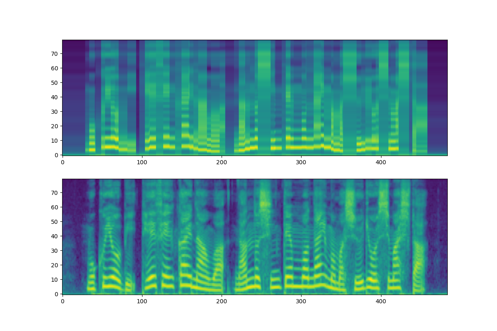

grad_tts
===

This repo contains the implementation of Grad-TTS([link](https://arxiv.org/abs/2105.06337)) for my study.

Difference between originals and this implementation is not using monotonic alignment.

# Generated Mel-Spectrogram

- top : Encoder output - Mean mel-spectrogram(frame level)
- bottom : Decoder output

